# Set up a virtual environment
 Set up a virtual environment

The objective of this tutorial is to:
* Lauch an AWS instance,
* Check for Python,
* Execute a Python script from that instance.

 # Choice of the instance

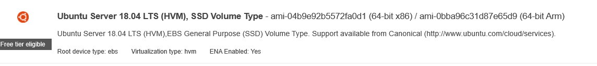

## Connection information & IP address of the instance

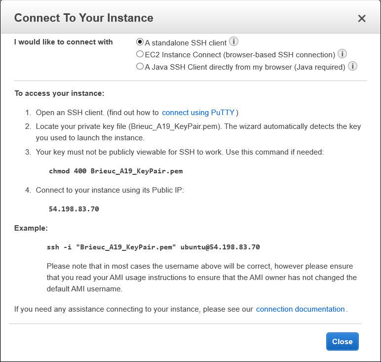

## Connection to the instance using ubuntu

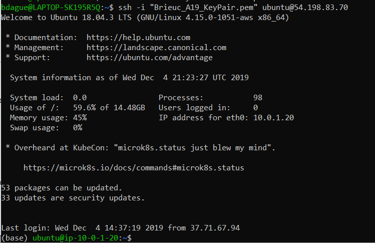

## Installation of Python on the Instance

* Update the list of available files into APT present into the configuration file.

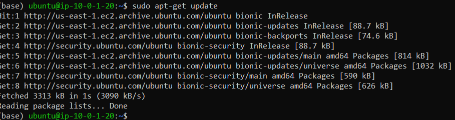

* Installation of Python3

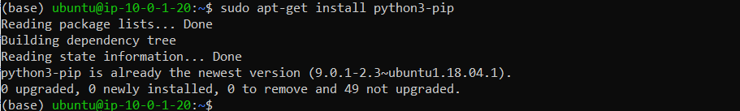

* Create a text file using the editor vi

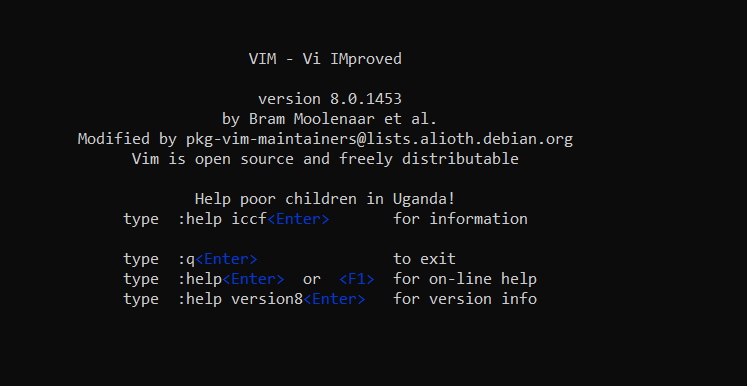

type "i" to include code. For example Print("Hello Brieuc").

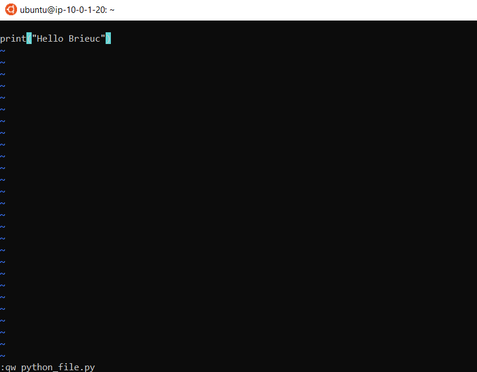

Check that we are able to run the Python file.

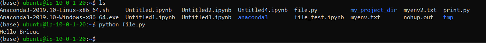

## Connection on Jupyter (user friendly environnement) from the Instance

Still by using Ubuntu.

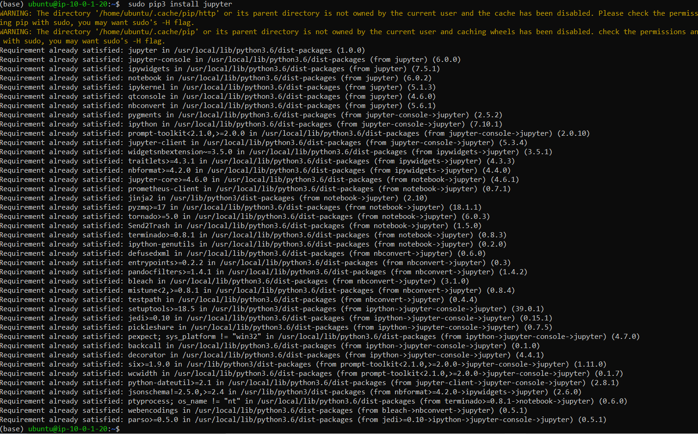

Configure to have access to it anytime type the following command:
**nohup jupyter notebook --ip=0.0.0.0&**

Getting information about the connection:

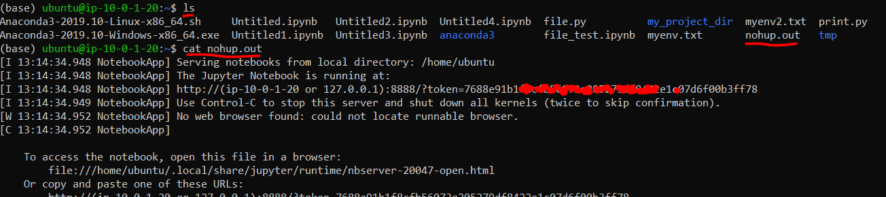

For closing the Jupyter notebook, you just need to type: **close jupyter notebook**

# Create virtual environment

You have two possibilities: using **Conda** or **Pew**

## By using Conda

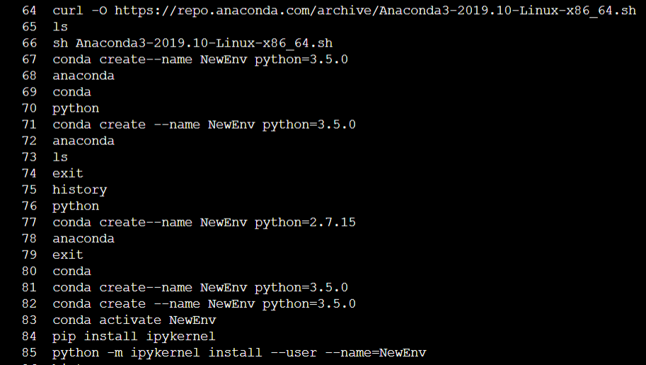

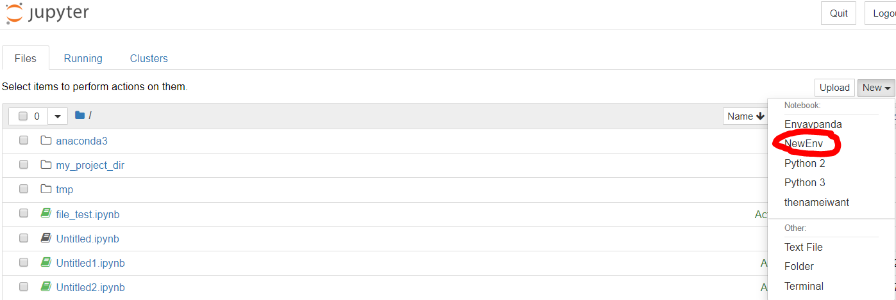

## By using Pew

* Installing Pew
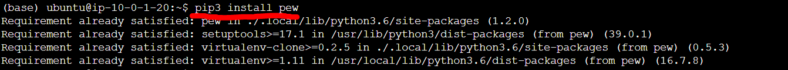

* Create a specific Kernel
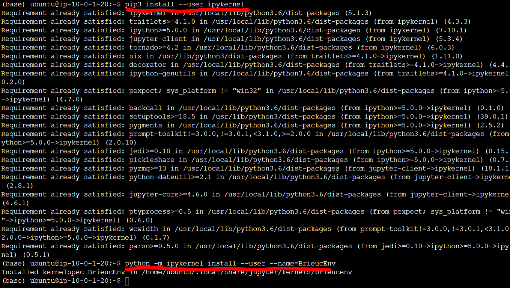

* Check the creation of the new environment
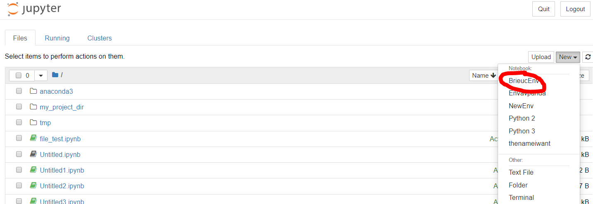
